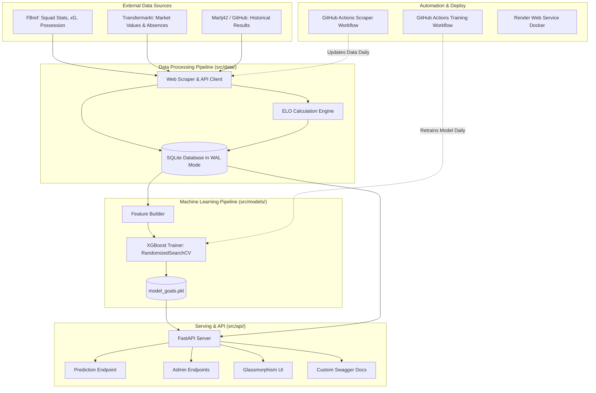
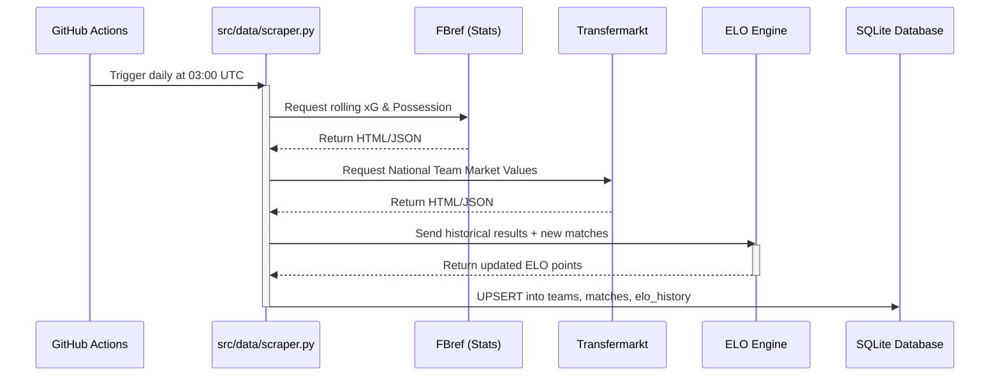
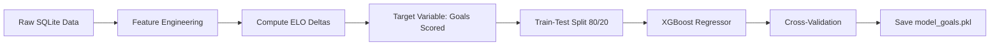
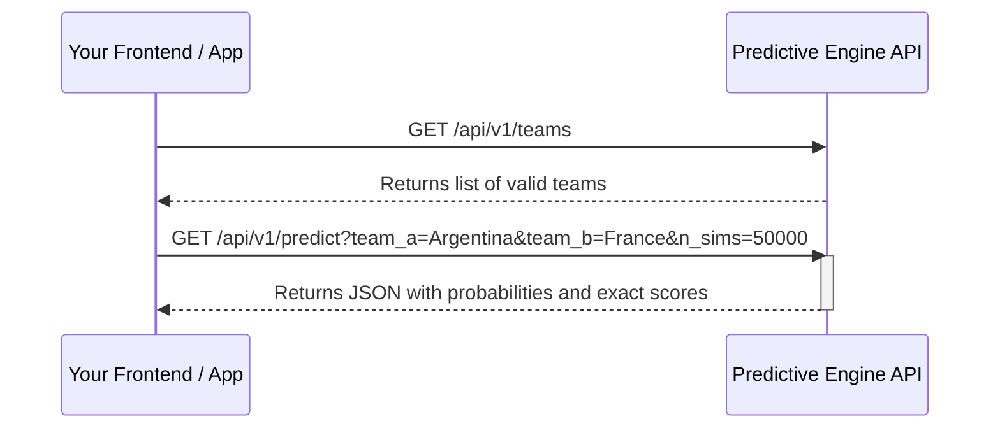

# World Cup Predictive Engine

A state-of-the-art, automated machine learning pipeline and API designed to predict the outcomes of international football matches. This project leverages historical match data, advanced squad statistics, market values, and ELO ratings to power a Poisson-based XGBoost prediction model, topped with Monte Carlo simulations to calculate precise match probabilities.

**Subtitle Tagline:** *Advanced ML Engine powered by Optimized Poisson-XGBoost & Monte Carlo Simulations*

---

## Table of Contents

1. [Project Overview](#project-overview)
2. [The Frontend & User Interface](#the-frontend--user-interface)
3. [Architecture & Data Pipeline](#architecture--data-pipeline)
4. [Machine Learning & Mathematics](#machine-learning--mathematics)
5. [Database & Concurrency](#database--concurrency)
6. [Security & Authentication](#security--authentication)
7. [Local Installation & Setup](#local-installation--setup)
8. [Automated CI/CD Deployment & Quality Gates](#automated-cicd-deployment--quality-gates)
9. [API Reference](#api-reference)
10. [Integration Guide (How to use in your project)](#integration-guide)
11. [Author](#author)

---

## Project Overview

Predicting international football matches is notoriously difficult due to the low-scoring nature of the sport and the infrequency of matches between teams from different confederations. This project solves these challenges by combining:
- **Historical ELO Ratings:** A dynamic, point-exchange measure of team strength calculated over decades of match history.
- **Squad Market Values:** Financial valuations from Transfermarkt representing raw squad talent and depth.
- **Advanced Tactical Metrics:** Expected Goals (xG), possession styles, and corner kick averages scraped from FBref.

The result is a production-grade, end-to-end predictive engine that calculates overall outcomes (wins, draws, losses), exact score matrices, expected goals (xG), possession dominance, corner kicks, yellow/red cards, and knockout-stage qualification probabilities.

---

## The Frontend & User Interface

While the core of this project is a powerful Machine Learning API, it comes completely out-of-the-box with a Premium, Glassmorphism-styled Web Dashboard. 

You do not need to deploy a separate frontend application. The FastAPI server directly serves the interactive HTML/JS/CSS frontend when you visit the root URL (`/`). 

### Key Features:
- **Interactive Simulator**: Select any of the 48 qualified World Cup 2026 teams.
- **Responsive Design**: Works perfectly on mobile and desktop devices.
- **Live Monte Carlo Simulations**: When you select two teams and click "Simulate", the frontend connects to the API, runs the configured parallel match simulations, and visualizes the probabilities in real-time.
- **Dynamic Knockout Logic**: Toggle the knockout setting to automatically simulate extra time and penalty shootouts if a match ends in a draw.
- **Player Absences System (Dynamic Playstyle Overrides)**: Adjust sliders to account for active squad absences (injuries/suspensions), dynamically recalculating ELO values.
- **Venue & Altitudes Control**: Specify host country and city (for altitude fatigue penalties).
- **Referee Strictness Selection**: Select the match referee to scale projected card metrics.
- **Visual Probability Matrices**: Displays a detailed heat-map of score probability distributions, highlighting the single most likely scoreline.
- **Custom Alert Modal**: Stylized modal overlays replace native browser alerts for validation issues.
- **Clean Scrollbars**: Global transparent scrollbars that blend cleanly with the dark dashboard aesthetic.
- **Favicon Integration**: Consistent official World Cup ball favicon rendering on both the dashboard and API documentation page.

---

## Architecture & Data Pipeline

The system is built on a decoupled architecture where data ingestion, model training, and API serving are handled efficiently and fully automated.

### 1. Overall System Architecture



### 2. Data Ingestion Pipeline Details

The data pipeline ensures that the models are constantly fed with the most recent tactical and historical data available.



### 3. Data Timeline & Scraper
The predictive engine gathers and processes data across three distinct time horizons to optimize predictive accuracy:

- **Historical Match Results (Since 1970):** Ingests international match records from January 1, 1970, to establish a highly calibrated, long-term ELO rating history for all national teams.
- **Machine Learning Training (Since 2010):** The dataset used to train the XGBoost model compiles matches and ELO ratings from 2010 onwards to focus the model on modern football tactics and performance trends.
- **Advanced Tactical Metrics (Since 2018):** Detailed styles of play (possession rates, shots on target, expected goals (xG), and corner kick averages) are collected from major tournaments from 2018 onwards (FIFA World Cup 2018/2022, UEFA Euro 2020/2024, and Copa América 2021/2024).
- **Squad Market Values:** Financial market values from Transfermarkt are integrated to represent the raw talent and market depth of each national squad.

---

## Machine Learning & Mathematics

### 1. The Poisson XGBoost Model
Football goals are discrete events occurring in a fixed interval (90 minutes). Therefore, they perfectly follow a **Poisson distribution**.
Instead of using standard Linear Regression (which could predict negative goals), our `XGBRegressor` is configured with `objective='count:poisson'`.

The unified regressor predicts the expected goal count (Lambda) of a team based on the following features:
- `is_home`: Home advantage flag.
- `elo_self`, `elo_opponent`, `elo_diff`: Current ELO ratings and their difference.
- `market_value_self`, `market_value_opponent`, `market_value_diff`: Transfermarkt valuation stats.
- `poss_style_self`, `poss_style_opponent`: Long-term possession style average.
- `xg_style_self`, `xg_style_opponent`: Rolling expected goals average.
- `rolling_gf_self_l5` / `rolling_ga_self_l5` (and `l10` equivalents): Recent goals scored/conceded.

#### Hyperparameter Optimization:
The model is tuned using `RandomizedSearchCV` over 3-fold cross-validation on Poisson deviance scoring (`scoring='neg_mean_poisson_deviance'`) to search for the best `max_depth`, `learning_rate`, and `n_estimators`.

### 2. Training Pipeline



### 3. Dynamic ELO Adjustments
Before a prediction is fed to the model, raw team stats are adjusted dynamically based on match contexts:

#### A. Squad Absences (Injuries/Suspensions)
Active absences are fetched from the database, and the raw ELO is penalized based on the severity of the missing players:
- **Star Player Absence:** Reduces team ELO by `2.5%` (`penalty += 0.025`).
- **Major Player Absence:** Reduces team ELO by `1.0%` (`penalty += 0.010`).
- **Minor Player Absence:** Reduces team ELO by `0.5%` (`penalty += 0.005`).

$$\text{ELO}_{\text{adjusted}} = \text{ELO}_{\text{raw}} \times (1 - \text{Absence Penalty})$$

#### B. Altitude Fatigue
If a match is simulated in a city higher than 1500m above sea level (e.g. La Paz, Bolivia at 3637m or Bogotá, Colombia at 2625m), non-acclimated teams suffer a dynamic fatigue factor:

$$\text{Fatigue Factor} = \max\left(0.70, \; 1.0 - 0.06 \times \frac{\text{Altitude in meters}}{1000}\right)$$

This fatigue factor adjusts the simulation parameters as follows:
- Expected Goals (Lambda) are scaled down: $\lambda_{\text{goals}} \leftarrow \lambda_{\text{goals}} \times \text{Fatigue Factor}$
- Expected Cards are scaled up: $\lambda_{\text{cards}} \leftarrow \lambda_{\text{cards}} \times (2.0 - \text{Fatigue Factor})$
- Possession share is re-balanced based on relative fatigue.

#### C. Referee Card strictness
Referees are tracked in the database. Projected card counts are scaled by comparing the referee's career yellow card average against a standard baseline of 4.0 cards per match:

$$\text{Referee Factor} = \frac{\text{Referee Avg Yellow Cards}}{4.0}$$

$$\lambda_{\text{cards}} \leftarrow \lambda_{\text{cards}} \times \text{Referee Factor}$$

### 4. Monte Carlo Simulations
Once the expected goal lambdas ($\lambda_A, \lambda_B$), corner lambdas, and card lambdas are calculated, the engine runs $N = 10,000$ simulation trials:
1. Simulates $N$ goal counts for each team using $X_A \sim \text{Poisson}(\lambda_A)$ and $X_B \sim \text{Poisson}(\lambda_B)$.
2. If `knockout` is enabled and a simulated match is a draw ($X_A = X_B$), the engine simulates 30 minutes of Extra Time (using $33.3\%$ of the 90-minute goal rate).
3. If still tied after Extra Time, it simulates a round-by-round penalty shootout where scoring success rates are derived from team ELO values.
4. Extra variance is added based on red card probabilities and altitude adjustments.

### 5. ELO Rating Engine
Our custom ELO engine calculates dynamic ratings. Every team starts at `1500`. After a match, points are exchanged based on:
1. **Actual Score vs Expected Outcome**: Beating a stronger team yields more points.
2. **Goal Difference**: A 4-0 win yields more points than a 1-0 win.
3. **Tournament Weight**: World Cup matches have a higher K-factor (importance) than friendlies.

---

## Database & Concurrency

The engine stores all match histories, ELO points, referee statistics, altitude mappings, and squad stats in a SQLite database. 

To ensure **100% uptime and high responsiveness**, the database is initialized in **WAL (Write-Ahead Logging) mode**:
- Reads are never blocked by writes, and writes do not block reads.
- When automated daily scraping routines update the database, API clients can query predictions concurrently with zero latency or locking issues.
- The database update script executes a complete `DELETE` prior to bulk upserts on fallbacks, keeping the database schema clean and free of duplicate stats.

---

## Security & Authentication

To protect the prediction pipeline and SQLite database, administrative endpoints (`/api/v1/admin/scrape` and `/api/v1/admin/train`) are secured. To access these endpoints, the request must include the `X-Admin-API-Key` header with the configured administrative key.

---

## Local Installation & Setup

Want to run the predictive engine on your own machine? Follow these steps:

### Prerequisites
- Python 3.11+
- Git

### Installation Steps

1. **Clone the repository:**
   ```bash
   git clone https://github.com/yourusername/personalworldcupproject.git
   cd personalworldcupproject
   ```

2. **Create and activate a virtual environment:**
   ```bash
   python -m venv venv
   # On Windows:
   venv\Scripts\activate
   # On macOS/Linux:
   source venv/bin/activate
   ```

3. **Install dependencies:**
   ```bash
   pip install -r requirements.txt
   ```

4. **Initialize the Database & Scraper:**
   Runs the pipeline to download all statistics, calculate initial ELO ratings, and write `database.sqlite`.
   ```bash
   python src/data/scraper.py
   ```

5. **Train the XGBoost Model:**
   Runs the hyperparameter optimization, evaluates the model, and saves `model_goals.pkl`.
   ```bash
   python src/models/train.py
   ```

6. **Start the FastAPI Server:**
   ```bash
   # Set the admin key locally
   set ADMIN_API_KEY=MyLocalSecretKey
   
   # Run the server
   uvicorn src.api.main:app --reload
   ```
   * Open `http://localhost:8000` to access the interactive web dashboard.
   * Open `http://localhost:8000/docs` to view the custom Swagger API documentation.

---

## Automated CI/CD Deployment & Quality Gates

This project is built for zero-cost, fully automated maintenance:

### 1. GitHub Actions (Fresh Data & Models)
Two workflows are set up under `.github/workflows/`:
- **`update_data.yml`**: Triggers daily to run the scraper, recalculate ELO ratings, and automatically commit the fresh database back to your repository. 
- **`update_model.yml`**: Retrains the XGBoost model daily on fresh data, saving the optimized `model_goals.pkl`.
- Ensure your GitHub Action has Read & Write permissions to commit files to the repo.

### 2. The Test Quality Gate
To prevent corrupted data or degenerate predictions from breaking production:
- Both workflows execute **`tests/test_predict.py`** prior to saving any changes.
- The test suite validates database records, runs simulation test suites, checks injury ELO adjustments, cards scaling, and altitude fatigue factors.
- If any test fails, the workflow aborts, preventing broken databases or models from committing.

### 3. Production Deployment (Render)
- The app is containerized using the included `Dockerfile`.
- Set up a new **Web Service** on Render pointing to your GitHub repository with the **Docker** runtime.
- Add `ADMIN_API_KEY` to the environment variables to secure administrative endpoints.

---

## API Reference

The API is fully documented via OpenAPI. You can explore it visually at `/docs`. Below are the core endpoints:

### GET /
Serves the HTML/CSS/JS frontend dashboard.

### GET /api/v1/health
Health check endpoint. Useful for Uptime monitors.

### GET /api/v1/predict
Executes a Monte Carlo simulation for a specific matchup.

**Query Parameters:**
- `team_a` (string, required): The name of the first national team.
- `team_b` (string, required): The name of the second national team.
- `neutral` (boolean, optional, default: `true`): True if played on neutral ground.
- `n_sims` (integer, optional, default: `10000`): Simulation iterations.
- `missing_players_a` (integer, optional, default: `0`): Absences for Team A.
- `missing_players_b` (integer, optional, default: `0`): Absences for Team B.
- `knockout` (boolean, optional, default: `false`): Enables extra time and penalty shootouts on draws.
- `city` (string, optional): The name of the host city.
- `country` (string, optional): The name of the host country.
- `referee` (string, optional): The name of the match referee.

---

## Integration Guide

Do you want to build your own frontend or mobile app that consumes this API? Here is how you can integrate the prediction engine into your projects.

### Standard Request Workflow



### Example: Using Fetch API in JavaScript (Vanilla / React / Vue)

You can easily call the prediction endpoint from any modern JavaScript framework.

```javascript
// Function to fetch a match prediction
async function fetchPrediction(teamA, teamB) {
  // Construct the URL with query parameters
  const baseUrl = "https://your-api.onrender.com/api/v1/predict";
  const params = new URLSearchParams({
    team_a: teamA,
    team_b: teamB,
    n_sims: 15000,
    neutral: true,
    knockout: true
  });

  try {
    const response = await fetch(`${baseUrl}?${params.toString()}`);
    
    if (!response.ok) {
      throw new Error(`HTTP error! status: ${response.status}`);
    }
    
    const data = await response.json();
    
    console.log("Win Probability for", teamA, ":", data.predictions.outcomes.win_a);
    console.log("Win Probability for", teamB, ":", data.predictions.outcomes.win_b);
    console.log("Draw Probability:", data.predictions.outcomes.draw);
    
    // You can access exact scores here
    const topScore = data.predictions.goals.top_exact_scores[0];
    console.log("Most likely score:", topScore.score, "at", (topScore.probability * 100).toFixed(2), "%");
    
    return data;
  } catch (error) {
    console.error("Error fetching prediction:", error);
  }
}

// Usage
fetchPrediction("Argentina", "France");
```

### Example: Using Python (Requests)

If you are building a Discord bot, Telegram bot, or a separate backend service, you can use the `requests` library in Python.

```python
import requests

def get_match_prediction(team_a, team_b):
    url = "https://your-api.onrender.com/api/v1/predict"
    params = {
        "team_a": team_a,
        "team_b": team_b,
        "n_sims": 10000,
        "missing_players_a": 1, # E.g., a key player is suspended
        "missing_players_b": 0,
        "knockout": False
    }
    
    response = requests.get(url, params=params)
    
    if response.status_code == 200:
        data = response.json()
        outcomes = data['predictions']['outcomes']
        print(f"Prediction for {team_a} vs {team_b}:")
        print(f"{team_a} Win: {outcomes['win_a']*100:.1f}%")
        print(f"Draw: {outcomes['draw']*100:.1f}%")
        print(f"{team_b} Win: {outcomes['win_b']*100:.1f}%")
    else:
        print("Error fetching data:", response.text)

# Usage
get_match_prediction("Brazil", "Spain")
```

### Handling Errors
When integrating, always be prepared to handle HTTP errors. The API will return `400 Bad Request` if a team is not found in the database, or `503 Service Unavailable` if the models haven't been trained yet.

---

# Author

<div align="center">

## Sebastián Huaypar Acurio

Computer Science Student @ UNI  
AI, Data Science & Analytics Engineering  
[LinkedIn](https://www.linkedin.com/in/sebashuaypar)

</div>
